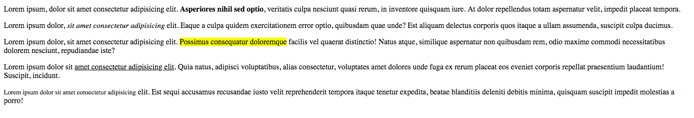

## HTML MARKUP: [Vídeo1](https://www.youtube.com/watch?v=FQ_FLZUln1Y) [Vídeo2](https://www.youtube.com/watch?v=CQAh-3NfjRU)

### Puntos Clave

- Conocer las etiquetas HTML más comunes.
- Entender cómo construir el esqueleto de una página web.

[Guía básica de HTML](https://www.w3schools.com/html/default.asp)

[Breve curso de HTML](https://www.codecademy.com/learn/web)

[Lista de etiquetas HTML](http://www.w3schools.com/tags/)

*Basic structure for HTML main page*

#### Ejercicio:
Usando solamente HTML recrea lo siguiente:

