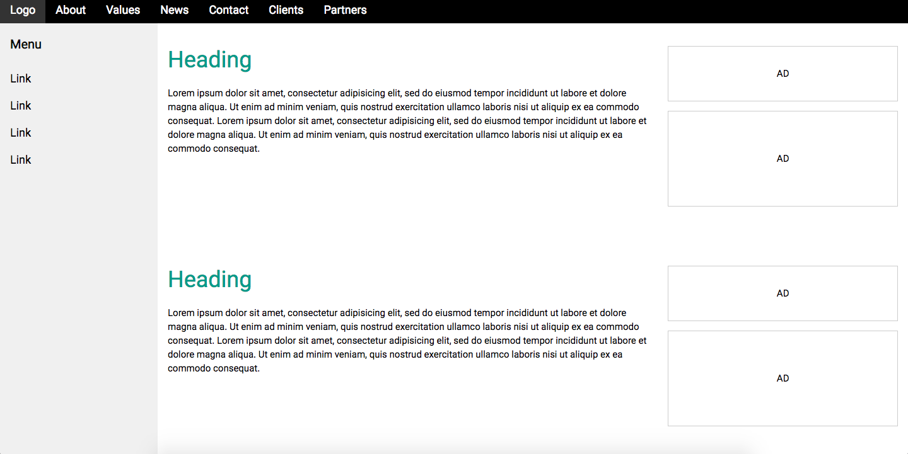
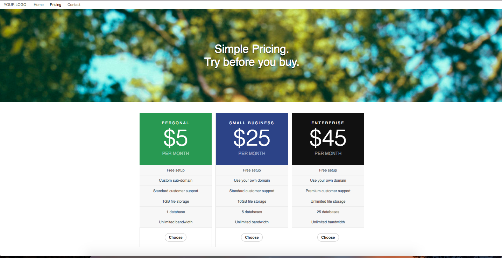

## CSS

### Puntos clave

- Aprender a dar estilo (con las propiedades básicas de CSS) a un HTML.
- Ver y crear dos layouts básicos de página web.

CSS es el lenguaje utilizado para dar estilos a tu página web. Te dejamos a continuación enlaces para aprender cómo utilizar CSS. 
Las herramientas son sencillas, pero solamente se domina a base de practicar. 

[CSS W3Schools](https://www.w3schools.com/css/exercise.asp)

[CSS Codecademy](https://www.codecademy.com/learn/learn-css)

**Exercise:**

Intenta replicar en la medida de lo posible los siguientes layouts.

